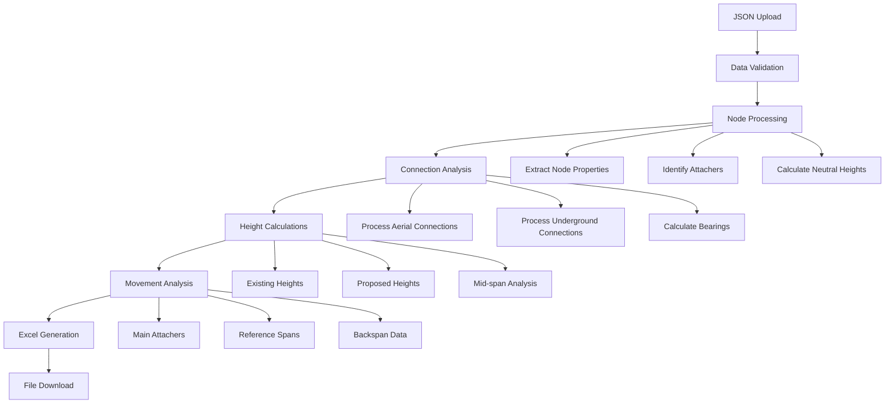

# MakeReady Report Generator

A comprehensive web application for processing utility pole attachment data and generating standardized Excel reports for make-ready analysis.

## Overview

The MakeReady Report Generator is a sophisticated tool designed for utility companies to process complex JSON data from field inspections and generate structured Excel reports. The application processes pole attachment data, calculates movement requirements, and produces detailed make-ready analysis reports used for utility pole infrastructure planning.

## Architecture

```
┌─────────────────┐    HTTP/WebSocket    ┌──────────────────┐    File Processing    ┌─────────────────┐
│   React UI      │ ◄─────────────────► │   FastAPI        │ ◄─────────────────► │   Processing    │
│   (Frontend)    │                     │   Backend        │                     │   Engine        │
└─────────────────┘                     └──────────────────┘                     └─────────────────┘
│                                       │                                        │
├─ File Upload Interface                 ├─ RESTful API                           ├─ JSON Data Parser
├─ Real-time Progress Updates            ├─ WebSocket Support                     ├─ Height Calculations
├─ Download Management                   ├─ Task Management                       ├─ Movement Analysis
└─ Error Handling                        └─ File Storage                          └─ Excel Generation
```

## Key Features

### 🔧 **Data Processing Engine**
- **JSON Parsing**: Processes complex nested JSON data from utility inspection systems
- **Height Analysis**: Calculates attachment heights, proposed movements, and clearance requirements
- **Bearing Calculations**: Computes geographic directions for span connections
- **Movement Summaries**: Generates detailed remediation requirements

### 📊 **Excel Report Generation**
- **Structured Output**: Creates organized Excel reports with merged cells and proper formatting
- **Multiple Data Categories**: Separates main attachers, reference spans, and backspan data
- **Comprehensive Metrics**: Includes pole specifications, responsible parties, and work classifications

### 🌐 **Web Interface**
- **Drag & Drop Upload**: Intuitive file upload with progress tracking
- **Real-time Updates**: WebSocket-based progress monitoring
- **Download Management**: Secure file download with automatic cleanup
- **Error Handling**: Comprehensive error reporting and user feedback

### ⚡ **Performance & Scalability**
- **Asynchronous Processing**: Non-blocking file processing using FastAPI
- **Memory Management**: Efficient handling of large JSON files
- **Task Management**: Background processing with status tracking

## Quick Start

### Prerequisites
- Python 3.8+
- Node.js 16+
- npm or yarn

### Installation

1. **Clone the repository**
   ```bash
   git clone <repository-url>
   cd makeready-report-generator
   ```

2. **Backend Setup**
   ```bash
   cd backend
   pip install -r requirements.txt
   ```

3. **Frontend Setup**
   ```bash
   cd frontend
   npm install
   npm run build
   ```

4. **Run the Application**
   ```bash
   # From the backend directory
   python app.py
   ```

5. **Access the Application**
   Open your browser to `http://localhost:8000`

## Project Structure

```
makeready-report-generator/
├── README.md                    # This file
├── requirements.txt             # Python dependencies
├── Procfile                     # Heroku deployment config
├── runtime.txt                  # Python runtime version
├── package.json                 # Node.js dependencies for deployment
├── backend/                     # FastAPI backend
│   ├── app.py                  # Main FastAPI application
│   ├── barebones.py            # Core processing engine
│   ├── requirements.txt        # Backend dependencies
│   └── README.md               # Backend documentation
├── frontend/                    # React frontend
│   ├── src/                    # Source code
│   ├── dist/                   # Built application
│   ├── package.json            # Frontend dependencies
│   └── README.md               # Frontend documentation
├── uploads/                     # Temporary file storage
├── outputs/                     # Generated reports (development)
├── templates/                   # Legacy templates
└── recaps/                      # Development documentation
```

## Usage

### 1. Upload JSON File
- Navigate to the web interface
- Drag and drop or select a JSON file from utility inspection software
- Supported format: JSON files from field inspection systems

### 2. Monitor Processing
- Real-time progress updates via WebSocket connection
- Processing stages: Upload → Parsing → Analysis → Excel Generation
- Error reporting with detailed feedback

### 3. Download Results
- **Excel Report**: Comprehensive make-ready analysis in structured format
- **Processing Log**: Detailed processing statistics and item breakdown

## Data Processing Workflow



## Core Processing Logic

The application's core processing engine (`barebones.py`) implements sophisticated algorithms for:

- **Neutral Wire Detection**: Identifies power line neutral wires for height filtering
- **Attachment Processing**: Categorizes and processes wire, equipment, and guying attachments
- **Height Calculations**: Converts measurements to standard foot-inch format
- **Movement Analysis**: Calculates required movements for compliance
- **Bearing Calculations**: Determines geographic directions using great-circle calculations
- **Excel Formatting**: Creates properly structured reports with merged cells

For detailed technical documentation, see [Backend README](backend/README.md).

## Deployment

### Local Development
```bash
# Backend
cd backend && python app.py

# Frontend (development)
cd frontend && npm run dev
```

### Production Deployment
The application is configured for deployment on Heroku with:
- Automatic dependency management
- Static file serving
- Environment-based configuration

See deployment files: `Procfile`, `requirements.txt`, `runtime.txt`

## API Documentation

### REST Endpoints
- `POST /api/upload` - Upload JSON file for processing
- `GET /api/tasks/{task_id}/status` - Get processing status
- `GET /api/tasks/{task_id}/download/{file_type}` - Download results
- `DELETE /api/tasks/{task_id}` - Cleanup task

### WebSocket
- `WS /ws/tasks/{task_id}` - Real-time status updates

## Technology Stack

### Backend
- **FastAPI**: Modern, fast web framework for Python
- **Pandas**: Data manipulation and Excel generation
- **XlsxWriter**: Excel file formatting
- **Uvicorn**: ASGI server implementation

### Frontend
- **React**: User interface framework
- **TypeScript**: Type-safe JavaScript
- **Tailwind CSS**: Utility-first CSS framework
- **Vite**: Fast build tool and development server

### Data Processing
- **JSON Processing**: Complex nested data structures
- **Mathematical Calculations**: Height conversions, bearing calculations
- **Geographic Calculations**: Great-circle distance and bearing formulas

## Contributing

1. Fork the repository
2. Create a feature branch
3. Make your changes
4. Add tests if applicable
5. Submit a pull request

## Support

For technical support or feature requests, please create an issue in the repository.

## License

[License information to be added]

---

**Version**: 2.0.0  
**Last Updated**: [Current Date]  
**Status**: Production Ready
