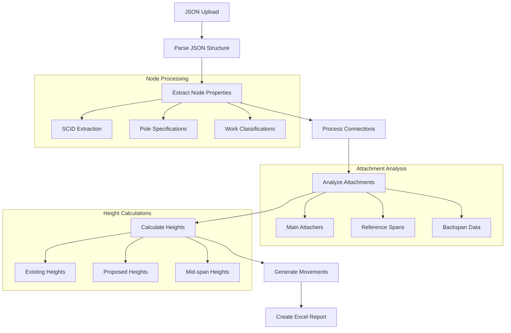

# Backend - MakeReady Report Generator

The FastAPI backend provides a robust API for processing utility pole attachment data and generating Excel reports.

## Architecture Overview

The backend follows a layered architecture pattern:

```
┌─────────────────────────────────────────────────────────────┐
│                     FastAPI Application                     │
├─────────────────────────────────────────────────────────────┤
│  API Layer (app.py)                                        │
│  ├─ REST Endpoints                                         │
│  ├─ WebSocket Handlers                                     │
│  ├─ File Upload Management                                 │
│  └─ Task Orchestration                                     │
├─────────────────────────────────────────────────────────────┤
│  Processing Engine (barebones.py)                          │
│  ├─ FileProcessor Class                                    │
│  ├─ Data Analysis Functions                                │
│  ├─ Height Calculations                                    │
│  └─ Excel Generation                                       │
├─────────────────────────────────────────────────────────────┤
│  Data Models & Utilities                                   │
│  ├─ Pydantic Models                                        │
│  ├─ WebSocket Manager                                      │
│  └─ Processing Logger                                      │
└─────────────────────────────────────────────────────────────┘
```

## Components

### 1. FastAPI Application (app.py)

The main application server that handles HTTP requests and WebSocket connections.

#### Key Features:
- **Async File Processing**: Non-blocking file uploads and processing
- **Real-time Updates**: WebSocket connections for progress monitoring
- **Memory Management**: In-memory task storage with automatic cleanup
- **Error Handling**: Comprehensive error reporting and logging

#### API Endpoints:

```python
# Health Check
GET /health

# File Processing
POST /api/upload                           # Upload JSON file
GET /api/tasks/{task_id}/status           # Get processing status
GET /api/tasks/{task_id}/download/{type}  # Download results
DELETE /api/tasks/{task_id}               # Cleanup task

# Real-time Updates
WS /ws/tasks/{task_id}                    # WebSocket connection
```

#### Request/Response Models:

```python
class UploadResponse(BaseModel):
    task_id: str
    filename: str
    status: str

class TaskStatus(BaseModel):
    task_id: str
    filename: str
    status: str
    created: str
    progress: Optional[int] = 0
    files: Optional[list] = []
    error: Optional[str] = None
```

### 2. Processing Engine (barebones.py)

The core data processing engine that transforms utility inspection JSON data into structured Excel reports.

#### FileProcessor Class

The main processing class that orchestrates the entire data transformation pipeline.

```python
class FileProcessor:
    def __init__(self):
        self.downloads_path = os.path.join(os.path.expanduser("~"), "Downloads")
        self.job_data = None
        self.logger = ProcessingLogger()

    def process_files(self, job_json_path, geojson_path=None)
    def process_data(self, job_data, geojson_data)
    def create_output_excel(self, path, df, job_data)
```

#### Processing Pipeline

1. **Data Loading & Validation**
   ```python
   def load_json(self, path) -> dict
   ```

2. **Node Processing**
   ```python
   def get_attachers_for_node(self, job_data, node_id) -> dict
   def get_neutral_wire_height(self, job_data, node_id) -> float
   ```

3. **Connection Analysis**
   ```python
   def get_lowest_heights_for_connection(self, job_data, connection_id) -> tuple
   def get_midspan_proposed_heights(self, job_data, connection_id, attacher_name) -> str
   ```

4. **Movement Calculations**
   ```python
   def get_movement_summary(self, attacher_data, cps_only=False) -> str
   def get_all_movements_summary(self, main_attachers, reference_spans, backspan_data) -> str
   ```

5. **Excel Generation**
   ```python
   def create_output_excel(self, path, df, job_data) -> None
   ```

### 3. ProcessingLogger Class

Comprehensive logging system for tracking processing statistics and debugging.

```python
class ProcessingLogger:
    def __init__(self):
        self.node_logs = []
        self.skip_reasons = defaultdict(int)
        self.statistics = {...}
    
    def log_node_start(self, node_id, scid, neutral_height)
    def log_item_processed(self, category, item_info)
    def log_item_skipped(self, category, item_info, reason)
    def write_summary(self, filename)
```

## Core Processing Logic

### Data Flow Overview



### Key Algorithms

#### 1. Neutral Wire Detection
```python
def get_neutral_wire_height(self, job_data, node_id):
    """
    Identifies the neutral wire height for filtering non-primary attachments.
    Used as a reference point for determining which attachments to include.
    """
```

**Logic:**
- Searches through photofirst_data for wire attachments
- Filters for CPS Energy company with "neutral" cable type
- Returns the measured height of the neutral wire
- Used for filtering attachments above/below neutral

#### 2. Height Formatting
```python
def format_height_feet_inches(self, total_in):
    """
    Converts total inches to standard utility format (e.g., "25'-6\"").
    Handles edge cases like 12 inches converting to 1 foot.
    """
```

**Algorithm:**
1. Divide total inches by 12 to get feet and remainder
2. Round remainder to nearest inch
3. Handle 12-inch remainder by adding 1 foot and setting inches to 0
4. Format as "XX'-YY\"" string

#### 3. Bearing Calculations
```python
def bearing_degrees(self, lat1, lon1, lat2, lon2):
    """
    Calculates great-circle bearing between two geographic points.
    Returns bearing in degrees (0-360°) where 0° is true north.
    """
```

**Mathematical Formula:**
- Uses spherical trigonometry to calculate bearing
- Converts to cardinal directions (N, NE, E, SE, S, SW, W, NW)
- Handles coordinate system conversions and edge cases

#### 4. Attachment Processing
```python
def get_attachers_for_node(self, job_data, node_id):
    """
    Processes all attachment types (wire, equipment, guying) for a node.
    Applies neutral height filtering and categorizes by type.
    """
```

**Processing Steps:**
1. **Data Extraction**: Get photofirst_data and trace_data
2. **Neutral Filtering**: Apply height filters based on neutral wire location
3. **Categorization**: Separate by wire/equipment/guying types
4. **Movement Calculation**: Process mr_move and _effective_moves data
5. **Height Formatting**: Convert to standard utility format

#### 5. Movement Analysis
```python
def get_movement_summary(self, attacher_data, cps_only=False):
    """
    Generates detailed movement summaries for remediation planning.
    Calculates required moves, installations, and modifications.
    """
```

**Movement Types:**
- **Raise/Lower**: Existing attachments requiring height adjustments
- **Install**: New proposed attachments
- **Add**: New guying or equipment installations

### Excel Report Structure

The generated Excel report follows a specific structure designed for utility industry standards:

#### Column Structure (27 columns):
1. **Operation Data**: Operation Number, Attachment Action, Pole Owner
2. **Pole Information**: Pole #, SCID, Structure, Proposed Riser/Guy
3. **Technical Data**: PLA %, Construction Grade, Height Analysis
4. **Attachment Details**: Category, Description, Heights (Existing/Proposed)
5. **Analysis Results**: Mid-Span Analysis, Movement Summary, Remedy Description
6. **Administrative**: Responsible Party, Red Tag Status, Comments

#### Data Categories:
- **Main_Attacher**: Primary pole attachments
- **Ref_Span_Header**: Reference span section headers
- **Ref_Span_Attacher**: Reference span attachment details
- **Backspan_Header**: Backspan section headers
- **Backspan_Attacher**: Backspan attachment details
- **Pole_Only**: Poles without attachments

#### Formatting Features:
- **Merged Cells**: Columns A-I merged vertically for each pole group
- **Headers**: Three-row header structure with merged column headers
- **Auto-sizing**: Dynamic column width adjustment
- **Data Formatting**: Consistent formatting for heights, bearings, and classifications

## Configuration

### Environment Variables
```bash
PORT=8000                    # Server port (default: 8000)
PYTHONPATH=./backend        # Python path for imports
```

### File Paths
```python
EXCEL_DATA_START_ROW = 4    # Excel data starting row
downloads_path = "~/Downloads"  # Output file location
```

### Processing Constants
```python
# Attachment Height Labels
EXISTING_ATTACHMENT_HEIGHT = "Attachment Height - Existing"
PROPOSED_ATTACHMENT_HEIGHT = "Attachment Height - Proposed"

# Span Height Labels  
EXISTING_SPAN_HEIGHT = "Mid-Span Existing"
SPAN_PROPOSED_HEIGHT = "Mid-Span Proposed"
```

## Error Handling

### Processing Errors
- **JSON Validation**: Malformed or invalid JSON structure
- **Data Missing**: Required fields or sections not found
- **Calculation Errors**: Invalid numeric data or edge cases
- **File I/O Errors**: Permission issues or disk space problems

### Logging System
- **Node-level Logging**: Detailed tracking per utility pole
- **Item Processing**: Success/failure tracking for each attachment
- **Skip Reasons**: Categorized reasons for excluded items
- **Statistics**: Comprehensive processing metrics

### WebSocket Error Handling
- **Connection Management**: Automatic cleanup on disconnect
- **Message Serialization**: JSON compatibility for all status updates
- **Timeout Handling**: Graceful handling of long-running processes

## Performance Considerations

### Memory Management
- **Streaming Processing**: Large files processed in chunks
- **In-memory Storage**: Temporary file data stored in BytesIO objects
- **Automatic Cleanup**: Old tasks removed after 1 hour

### Processing Optimization
- **Efficient Algorithms**: Optimized height calculations and filtering
- **Minimal File I/O**: Reduced disk operations during processing
- **Parallel Processing**: Async operations for non-blocking performance

### Scalability
- **Task Management**: Multiple concurrent file processing
- **Resource Limits**: Configurable limits for file size and processing time
- **Background Tasks**: Automatic cleanup and maintenance

## Testing & Debugging

### Debug Features
```python
# Enable detailed logging
print(f"DEBUG: Processing node {node_id} with {len(attachers)} attachers")

# Height calculation debugging
print(f"DEBUG_FORMAT: Input total_in: {total_in}")
print(f"DEBUG_FORMAT: Result: {formatted_height}")
```

### Processing Logs
- **Node Statistics**: Total nodes processed, success/failure rates
- **Item Breakdown**: Detailed categorization of processed items
- **Skip Reasons**: Analysis of excluded data with explanations
- **Performance Metrics**: Processing time and memory usage

### Common Issues
1. **Missing Neutral Wire**: Affects height filtering logic
2. **Invalid Height Data**: Non-numeric or missing height measurements  
3. **Trace Data Mismatch**: Trace IDs not found in trace_data section
4. **Geographic Coordinates**: Missing lat/lon data affects bearing calculations

## Dependencies

### Core Dependencies
```txt
fastapi==0.104.1            # Web framework
uvicorn==0.24.0            # ASGI server
pandas==2.2.3              # Data manipulation
xlsxwriter==3.2.3          # Excel file generation
python-multipart==0.0.6    # File upload support
websockets==12.0           # WebSocket support
```

### Development Dependencies
```txt
pytest==7.4.3             # Testing framework
black==23.11.0             # Code formatting
flake8==6.1.0              # Linting
mypy==1.7.1                # Type checking
```

## Development Setup

### Local Development
```bash
# Install dependencies
pip install -r requirements.txt

# Run development server with auto-reload
uvicorn app:app --reload --host 0.0.0.0 --port 8000

# Run with debug logging
export LOG_LEVEL=DEBUG
python app.py
```

### Testing
```bash
# Run all tests
pytest

# Run with coverage
pytest --cov=. --cov-report=html

# Test specific component
pytest tests/test_processing.py -v
```

---

**Version**: 2.0.0  
**Last Updated**: January 2025  
**Maintainer**: Development Team
